# ArenaData QuickMarts installation scripts

docker-deploy.sh and install.sh documentation. Important sections:

1. [Redeployment/Docker](#docker-deploy)
	1. [Privileged mode](#docker-deploy-priv)
	1. [Important notes](#docker-deploy-important)
1. [Cluster installer](#install)
	1. [Important notes](#install-important)

***

## ADCM and Nodes (re)Deployment Scripts

### Docker-compose (docker-deploy.sh) <a name="docker-deploy"></a>

#### Description

Script name: docker-deploy.sh Steps performed by the script:

- stop containers, 
- remove ADCM (ArenaData Cluster Manager) image and settings
- build required images
- start containers

*Note: Script returns 'exit 0' instantly after container start, it's not waiting for full ADCM start.*

#### Dependencies

- docker installed
- docker-compose installed
- privileged mode enabled for docker
- docker-compose.yml and Dockerfile in the same folder

Docker-compose specification used for ADCM and ClickHouse nodes definition. Dockerfile contains all the commands a user could call on the command line to assemble ClickHouse node image.
No user-defined environment variables required.

##### Docker privileged mode <a name="docker-deploy-priv"></a>
Privileged mode required fo ClickHouse containers. Without privileged mode container SystemD services such as 'sshd' will fail to start.

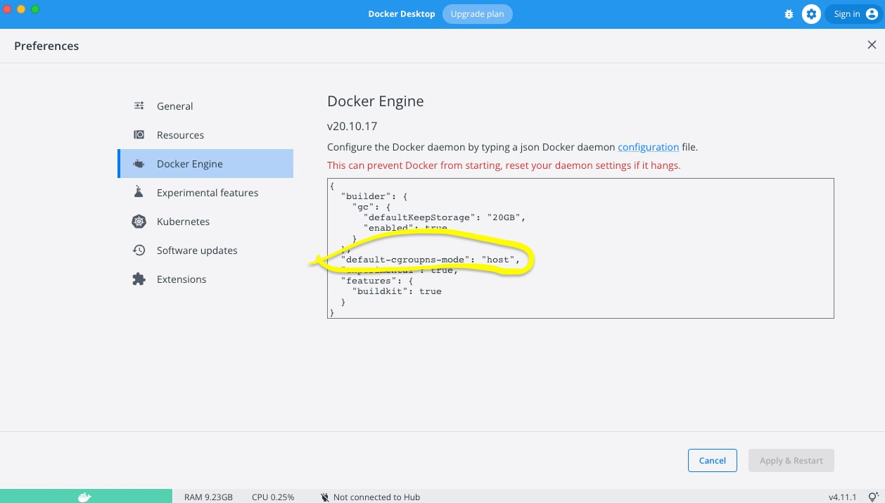
Config example (OSX):
```
{
  "builder": {
    "gc": {
      "defaultKeepStorage": "20GB",
      "enabled": true
    }
  },
  "default-cgroupns-mode": "host",
  "experimental": false,
  "features": {
    "buildkit": true
  }
}
```
This specific line ```default-cgroupns-mode": "host"``` enables privileged mode.

#### Volumes

Script creates container volumes based on 'docker-compose.yml' definition.
In script itself, volumes/adcm cleaning is hard-coded. So it always removes ADCM cluster configuration.

##### Important notes <a name="docker-deploy-important"></a>

**[[Important]]**: If you want to change volume location, change both 'docker-compose.yml' and 'docker-deploy.sh'

**[Important]** Script does not clean ClickHouse data volume, but you may need to clean it manually if you restart deployment scripts while *decreasing host count*


***

## Cluster installer script <a name="install"></a>
Script name: 'install.sh'. Script waits for ADCM start (no timeout set) and can be started right after ADCM deployment script. 
### Dependencies
	
- Bash (Unix shell)
- GNU Core Utilities or coreutils 
- Additional software
	- curl
	- jq
	- mktemp
	- rename
- Settings Files (JSON) in any location:
	- ADCM Settings file ```-- adcm-config <adcm config>.json```
	- ADQM Settings file ```--adqmdb-config <adqmdb config>.json```
- Bundle files ```--bundles-location <bundles location directory>```	
	- SSH Common Bundle https://store.arenadata.io/#products/arenadata_cluster_manager
	- ADQM Bundle https://store.arenadata.io/#products/arenadata_quickmarts	see "Infrastructure Bundles" section
- Environment Variables
	- ADCM_USERNAME and ADCM_PASSWORD
		<br>```export ADCM_USERNAME=...``` 
		<br>```export ADCM_PASSWORD=...```
		<br>ADCM Default Login and password: https://docs.arenadata.io/adcm/user/quick.html
	- ANSIBLE_USERNAME and ANSIBLE_PASSWORD
		<br>```export ANSIBLE_USERNAME=root```
		<br>```export ANSIBLE_PASSWORD=root```


#### Tested Versions
bash-3.2.57(1)-release, curl-7.79.1, jq-1.6, rename-1.601

### Example and parameters description 

```
./install.sh -a http://localhost:8000 -b bundles -c "ADQM Cluster" -t "ch1 ch2 ch3 ch4" --adcm-config adcmconfig.json --adqmdb-config adqmdbconfig.json --
```
```-a http://localhost:8000``` – define ADCM address, the script will use API from this host

```-b bundles``` – specify directory with bundle files
	```
		$ ls bundles
		adcm_host_ssh_v2.7-1_community.tgz
		adcm_cluster_adqm_v22.3.7.28_arenadata1_b1-1_community.tgz
	```

```-c "ADQM Cluster"``` – tell ADCM the name of the new Cluster

```-t "ch1 ch2 ch3 ch4"``` – tell ADCM target hostnames (Cluster member names)

```--adcm-config adcmconfig.json``` – configuration JSON file for Global Configuration http://localhost:8000/admin/settings

```--adqmdb-config adqmdbconfig.json``` - configuration JSON file for ADCM/CLUSTERS/ADQM CLUSTER/SERVICES/ADQMDB

### Installation steps description

The script configures ADCM and installs ADQMDB cluster. Result of each step displayed below.

1. ADCM settings applied (from file provided by --adcm-config option)
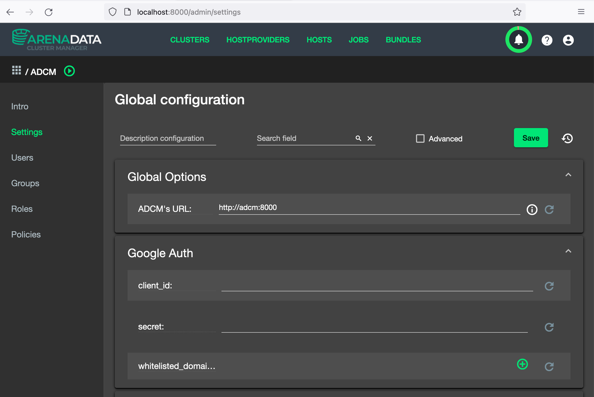

1. 
Bundle upload from specified bundles directory (-b / --bundles-location).
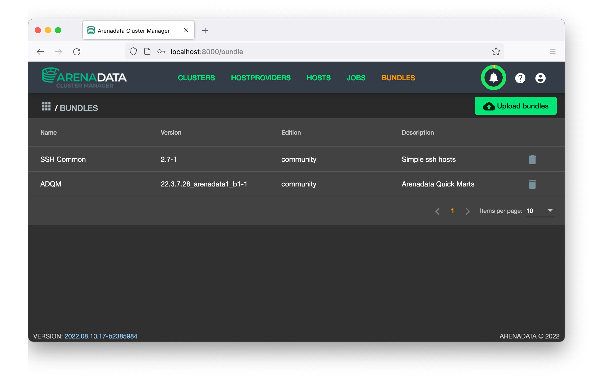

1. Host provider created.
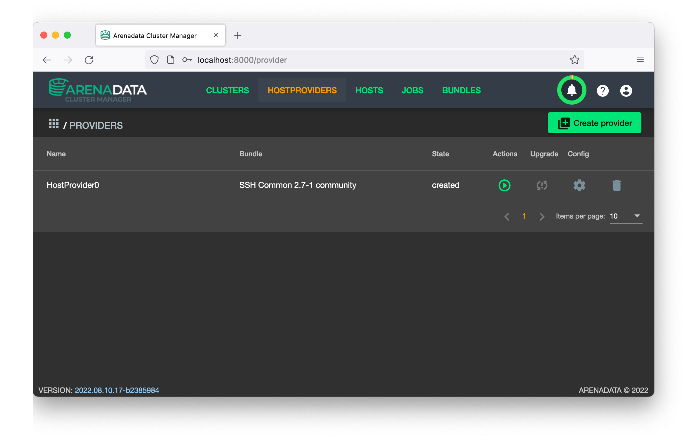

1. Hosts created (defined by -t / --target-hosts option).
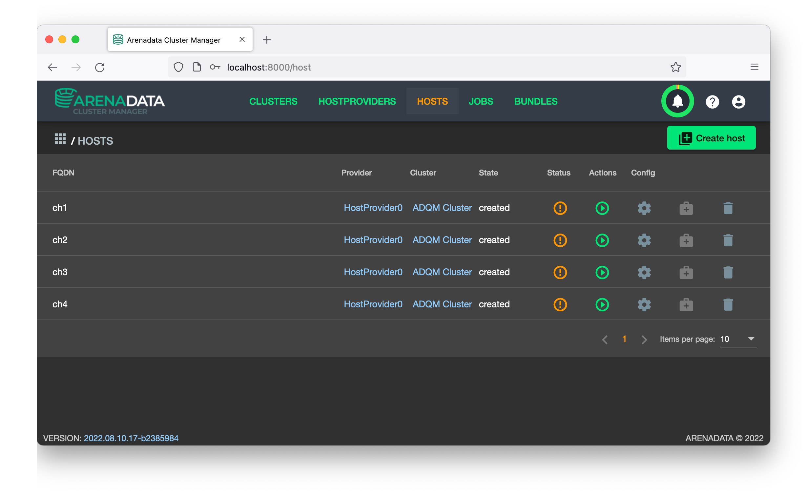

1. Host settings applied. Host username and password taken from $ANSIBLE_USERNAME and $ANSIBLE_PASSWORD env. variables.
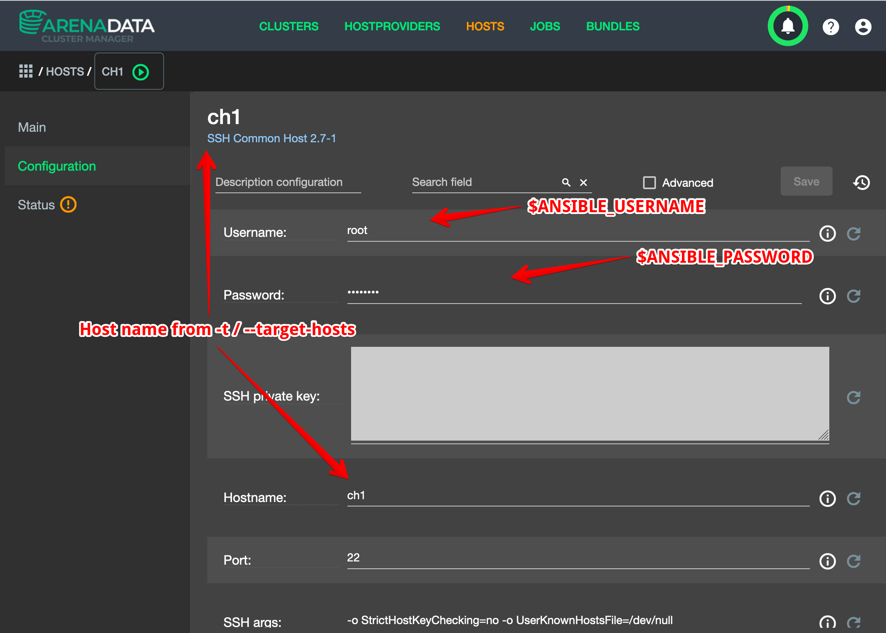

1. Status checkers installed for all hosts.
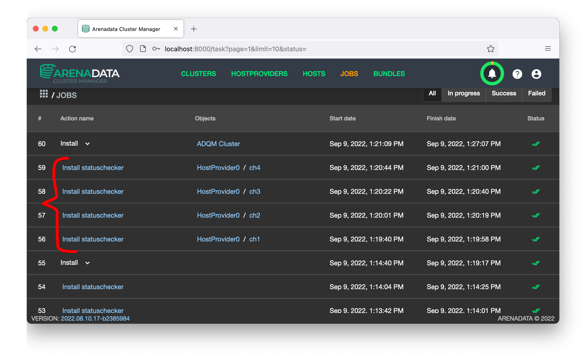

1. Cluster created. Cluster name is taken from -c / --cluster-name option. Services added to the cluster.
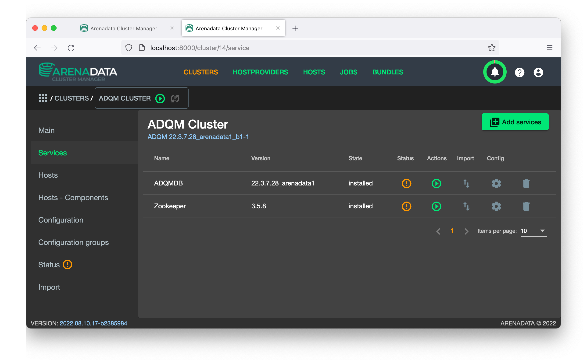

1. ADQM settings modified (from file provided by --adqmdb-config option).
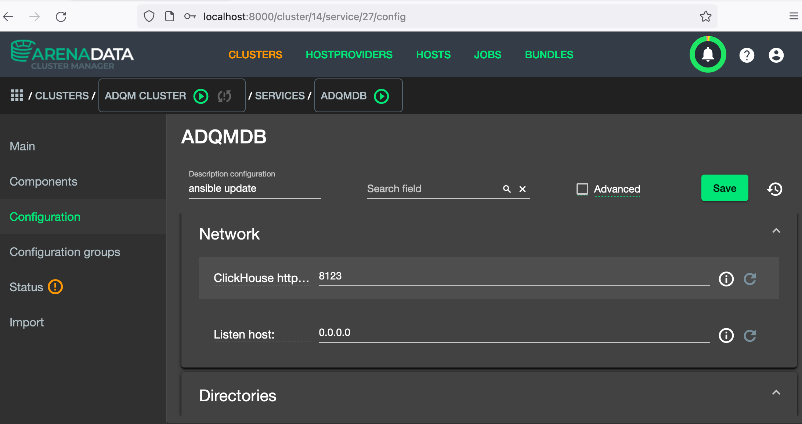

1. Hosts added to the cluster. Script adds all the hosts defined on previous steps.
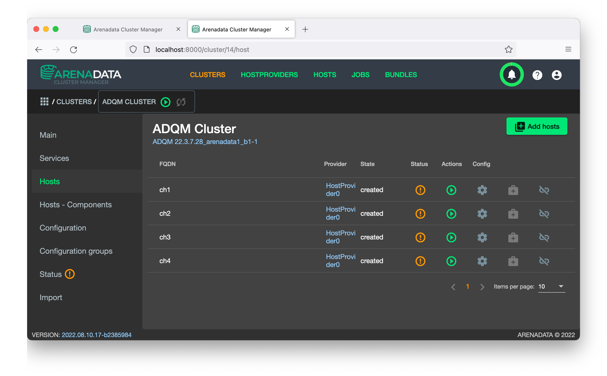

1. Service Components mapped to cluster hosts (all-to-all except for Zookeeper). Zookeeper Cluster requires odd member for cluster voting consensus.
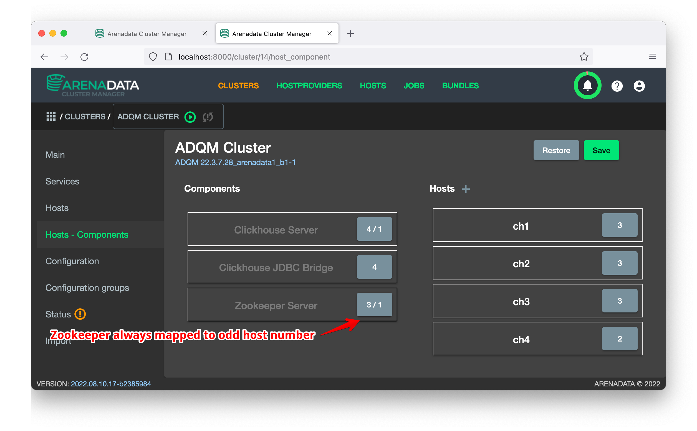

1. Installation starts
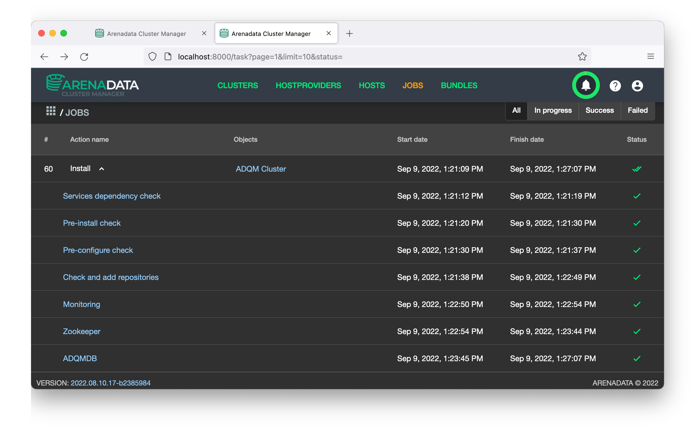

1. Installation success
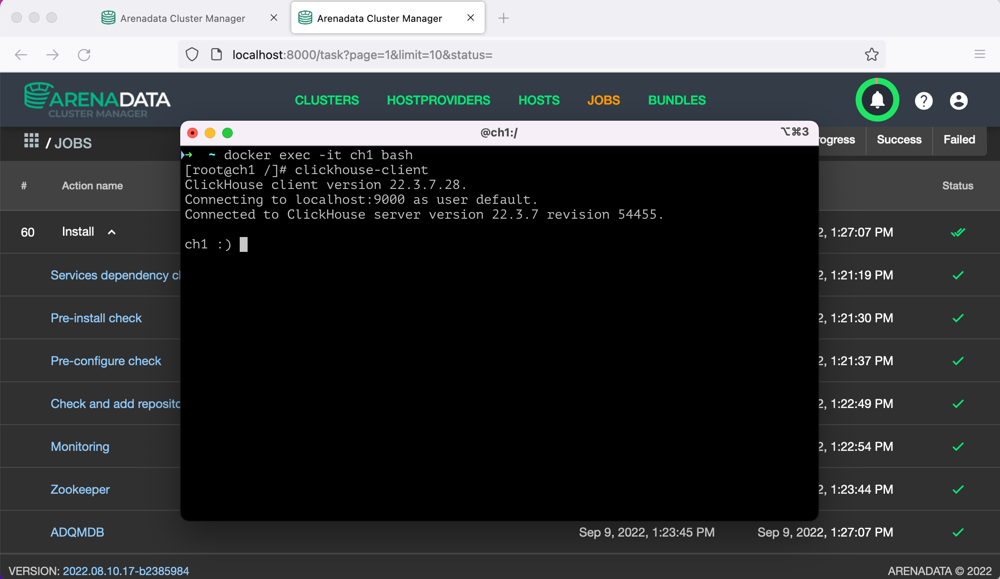

### Important notes <a name="install-important"></a>

You may need to delete Cluster, HostProvider and Hosts from ADCM if:
	- Cluster name already exists
	- One of the hosts you define in ```-t``` is already part of the cluster

**[Important]** Make sure you have a valid backup of your ADQM DB Data if you modify or reinstall the cluster.

### Remote connection

To connect, make sure that at least one ClickHouse host is exposing port 8123. If you use Docker deployment, modify docker-compose.yml before host deployment.

Once you got host with open port, you need to log into the host

```
docker exec -it ch3 bash
```

And create a new user

```
# clickhouse-client

ch1 :) CREATE USER user HOST ANY IDENTIFIED WITH sha256_password BY 'password';

Ok.

0 rows in set. Elapsed: 0.009 sec.

ch1 :) GRANT SELECT ON * TO user;

Ok.

0 rows in set. Elapsed: 0.005 sec.

ch1 :) Bye.
```

Now you should be able to connect from a remote machine. Here is an example for DBeaver database client.

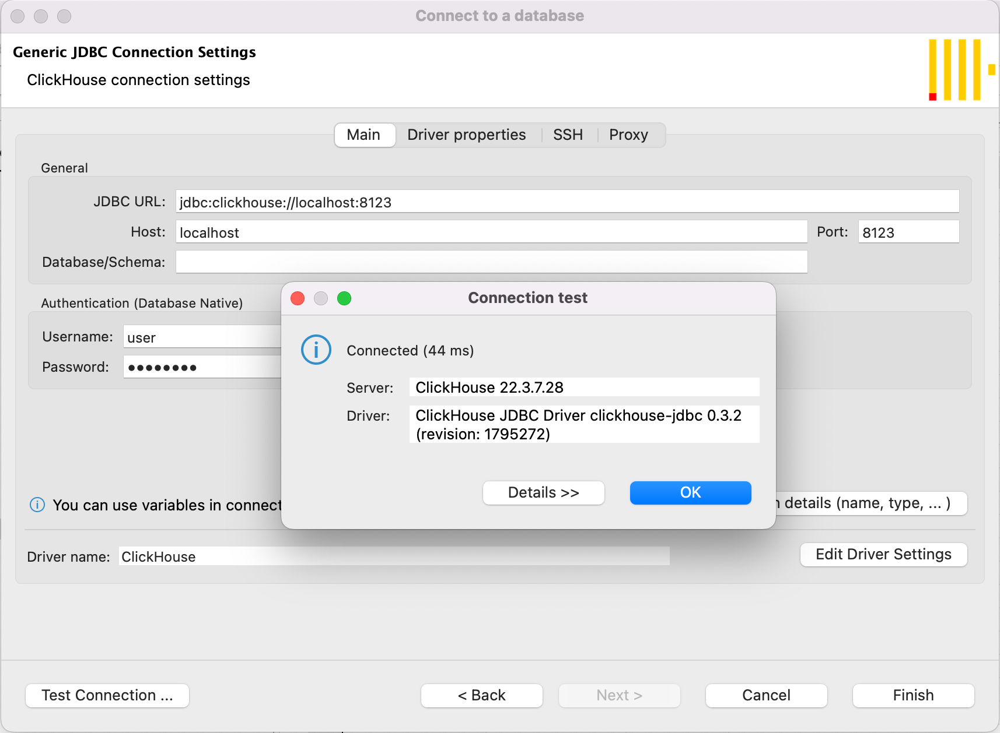

### Connect to remote RDBBMS using clickhouse-jdbc

To read data from remote database, log into one of the nodes

```
docker exec -it ch3 bash
```

then, edit datasource in ```/etc/clickhouse-jdbc-bridge/config/datasources```.

Datasource example for PostgreSQL:
```
[root@ch3 datasources]# cat postgres13.json
{
  "$schema": "../docker/config/datasource.jschema",
  "postgres13": {
    "converter": {
      "mappings": [{ "nativeType": "bool", "toType": "String" }]
    },
    "driverUrls": [
      "https://repo1.maven.org/maven2/org/postgresql/postgresql/42.2.24/postgresql-42.2.24.jar"
    ],
    "driverClassName": "org.postgresql.Driver",
    "jdbcUrl": "jdbc:postgresql://< host >/< database >",
    "username": < user >,
    "password": < password >,
    "initializationFailTimeout": 0,
    "minimumIdle": 0,
    "maximumPoolSize": 10
  }
}
```

Datasource example for MySQL:
```
[root@ch3 datasources]# cat mysql8.json
{
  "$schema": "../docker/config/datasource.jschema",
  "mysql8": {
    "driverUrls": [
      "https://repo1.maven.org/maven2/mysql/mysql-connector-java/8.0.26/mysql-connector-java-8.0.26.jar"
    ],
    "driverClassName": "com.mysql.cj.jdbc.Driver",
    "jdbcUrl": "jdbc:mysql://< host >/< database >?allowPublicKeyRetrieval=true&useSSL=false&useCompression=false&useOldAliasMetadataBehavior=true&allowMultiQueries=true",
    "username": < user >,
    "password": < password >,
    "initializationFailTimeout": 0,
    "minimumIdle": 0,
    "maximumPoolSize": 10
  }
}
```

Make sure to change host, database, user and password. Usage examples from ClickHouse documentation: https://clickhouse.com/docs/en/sql-reference/table-functions/jdbc/

Tested read examples (from PostgreSQL and from MySQL):

```
[root@ch3 datasources]# clickhouse-client
ClickHouse client version 22.3.7.28.
Connecting to localhost:9000 as user default.
Connected to ClickHouse server version 22.3.7 revision 54455.

ch3 :) select * from jdbc('postgres13', '', 'temperature')

SELECT *
FROM jdbc('postgres13', '', 'temperature')

Query id: dedba154-f53a-4dfe-85fe-1cdc1feab9a8

┌─location_id─┬──────────────────timestamp─┬───value─┐
│           1 │ 2022-09-13 17:33:33.780000 │ 20.0002 │
└─────────────┴────────────────────────────┴─────────┘

1 rows in set. Elapsed: 0.072 sec.

ch3 :) select * from jdbc('mysql8', 'ch_src', 'temperature')

SELECT *
FROM jdbc('mysql8', 'ch_src', 'temperature')

Query id: db702d8c-b927-4471-9d42-2989a55404c8
```
